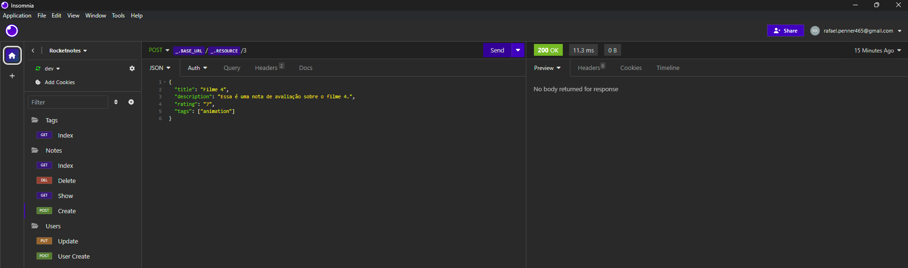
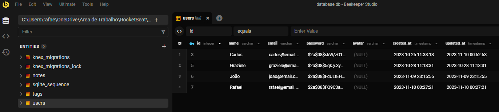
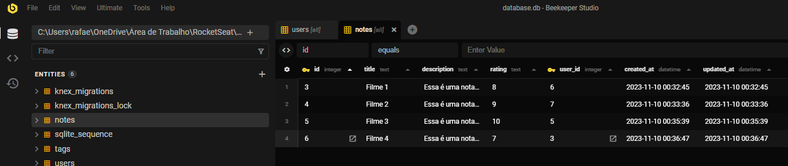
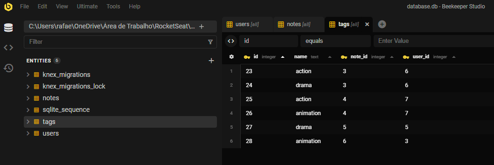

### desafio_stage_08_node_movie

Neste desafio foi desenvolvida uma aplicação em Node.js onde o usuário pode cadastrar um filme, preenchendo uma nota com algumas informações sobre e tags relacionadas ao filme.

